# Roleta Európeia

A roleta tem alguns estados
    - Estados de apostas, onde o usuário pode selecionar o número em que deseja apostar e a quantidade de fichas que deseja apostar (Geralmente dura em torno de 15 segundos)
    - Apostas fechadas, logo após o estado de apostas encontramos o estado de apostas fechadas, este momento é onde o Dealer inicia o movimento da bolinha (Geralmente dura em torno de 2 segundos)
    - Rodando, logo após o estado de apostas fechadas é encontrado o estado de Rodando, este momento é o tempo em que a bolinha demora para cair e ficar estatíca em um unico número (A duração deste estado é variável de acordo com a força do Dealer)
    - Número ganhador, logo após a bolinha parar de girar, entramos no estado de número ganhador, que é onde é informado aos jogadores qual número foi "escolhido" e consequentemente é neste estado onde encontramos os jogadores que foram ganhadores, de acordo com qual número saiu, precisamos encontrar todos as combinações possíveis de aposta onde o jogador é ganhador

Temos algumas formas de apostar

1. Na COR (Vermelho | Preto)
    - 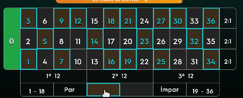
            
    - 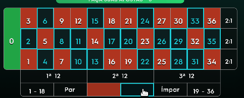

2. Nos Menores (1 - 18)
    - 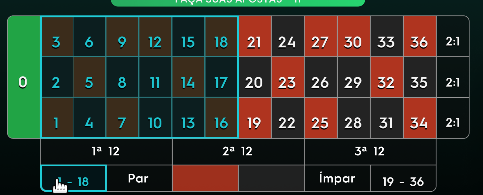
3. Nos Maiores (19 - 36)
   - 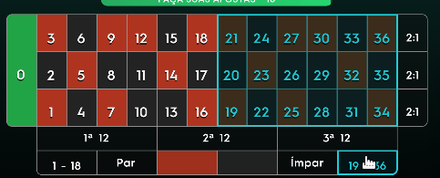
4. Nas Colunas
    - 1 - ( 1,4,7,10,13,16,19,22,25,28,31,34)
    - 2 - (2,5,8,11,14,17,20,23,26,29,32,35)
    - 3 - (3,6,9,12,15,18,21,24,27,30,33,36)
        - 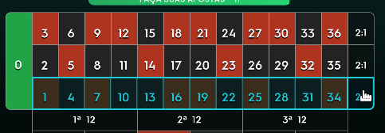
5. As duzias
    - 1 - (1----12)
    - 2 - (13---24)
    - 3 - (25---36)
      - 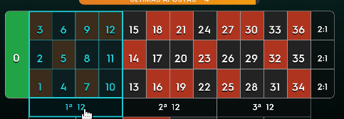
6. No impar ou Par
    - 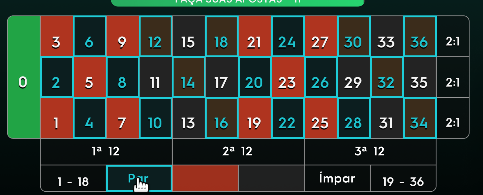
    - 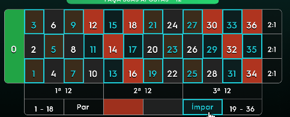
7. Nos números
    - 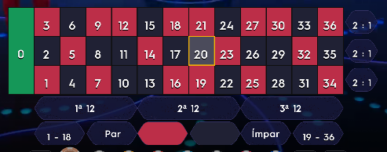
8. Nas linhas
    - 1-3
    - 4-6
    - 7-9
    - 10-12
    - 13-15
    - 16-18
    - 19-21
    - 22-24
    - 25-27
    - 28-30
    - 31-33
    - 34-36
      - 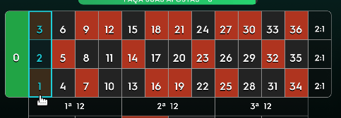
9. Combinação de Dois em Dois (Split)
    - 2 & 3
    - 4 & 5
    - 5 & 6
    - 7 & 8
    - 8 & 9
    - 10 & 11
    - 11 & 12
    - 13 & 14
    - 14 & 15
    - 16 & 17
    - 17 & 18
    - 19 & 20
    - 20 & 21
    - 22 & 23
    - 23 & 24
    - 25 & 26
    - 26 & 27
    - 28 & 29
    - 29 & 30
    - 31 & 32
    - 32 & 33
    - 34 & 35
    - 35 & 36
    - 1 & 4
    - 2 & 5
    - 3 & 6
    - 4 & 7
    - 5 & 8
    - 6 & 9
    - 7 & 10
    - 8 & 11
    - 9 & 12
    - 10 & 13
    - 11 & 14
    - 12 & 15
    - 13 & 16
    - 14 & 17
    - 15 & 18
    - 16 & 19
    - 17 & 20
    - 18 & 21
    - 19 & 22
    - 20 & 23
    - 21 & 24
    - 22 & 25
    - 23 & 26
    - 24 & 27
    - 25 & 28
    - 26 & 29
    - 27 & 30
    - 28 & 31
    - 29 & 32
    - 30 & 33
    - 31 & 34
    - 32 & 35
    - 33 & 36
        - 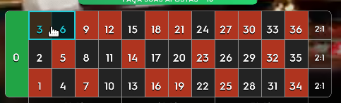
10. Combinação de Quatro em Quatro (Quadros)
    - 1 & 2 & 4 & 5
    - 2 & 3 & 5 & 6
    - 4 & 5 & 7 & 8
    - 5 & 6 & 8 & 9
    - 7 & 8 & 10 & 11
    - 8 & 9 & 11 & 12
    - 10 & 11 & 13 & 14
    - 11 & 12 & 14 & 15
    - 13 & 14 & 16 & 17
    - 14 & 15 & 17 & 18
    - 16 & 17 & 19 & 20
    - 17 & 18 & 20 & 21
    - 19 & 20 & 22 & 23
    - 20 & 21 & 23 & 24
    - 22 & 23 & 25 & 26
    - 23 & 24 & 26 & 27
    - 25 & 26 & 28 & 29
    - 26 & 27 & 29 & 30
    - 28 & 29 & 31 & 32
    - 29 & 30 & 32 & 33
    - 31 & 32 & 34 & 35
    - 32 & 33 & 35 & 36
        -  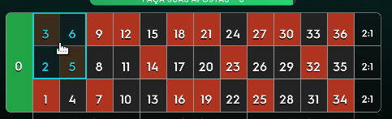
12. Vizinhos do Zero
    - 22
    - 18
    - 29
    - 7
    - 28
    - 12
    - 35
    - 3
    - 26
    - 0
    - 32
    - 15
    - 19
    - 4
    - 21
    - 2
    - 25
13. Terços da Roda
    - 27
    - 13
    - 36
    - 11
    - 30
    - 8
    - 23
    - 10
    - 5
    - 24
    - 16
    - 33
14. Orfãos
    - 1
    - 6
    - 9
    - 14
    - 17
    - 20
    - 31
    - 34
15. Vizinhos
    - 30
    - 23
    - 8
    - 10
    - 5
16. Aposta Final (Todos os Números com final de qual escolheu )
    - 0, 10, 20, 30
    - 1, 11, 21, 31
    - 2 ,12, 22, 32,
    - 3, 13, 23, 33
    - 4, 14, 24, 34
    - 5, 15, 25, 35
    - 6, 16, 26, 36
    - 7, 17, 27
    - 8, 18, 28
    - 9, 19, 29
